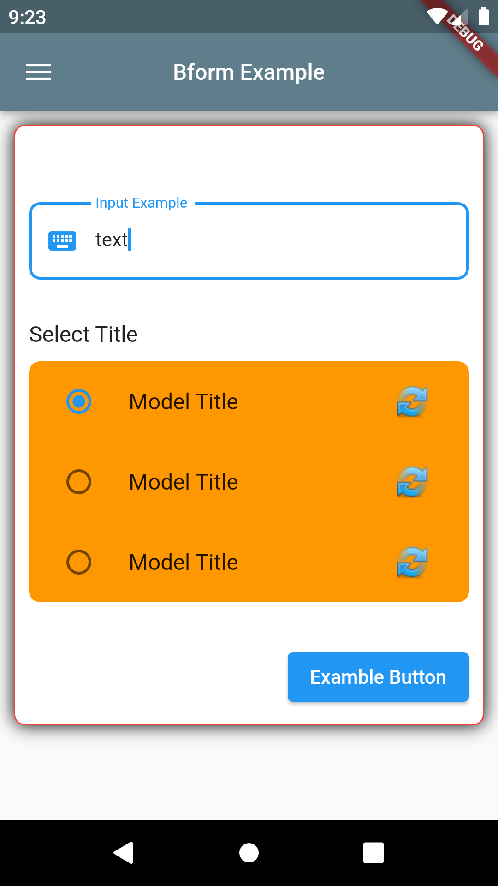

## Bform

Package to help you create beautiful forms widgets.

| **Support** | Android | iOS | Linux | macOS | Web | Windows |
|-------------|---------|------|-------|--------|-----|-------------|

## Features

- appbar
- footer

- form widgets
- table widgets


## Getting started

2. To use this package, add bform as dependency in your `pubspec.yaml` file:

```yaml
dependencies:
   bform:
```

3. Import the package into your dart file:

```dart
import 'package:bform/bform.dart';
```

## Usage

```dart
import 'package:flutter/material.dart';
import 'package:bform/bform.dart';

void main() => runApp(const MyApp());

class MyApp extends StatelessWidget {
  const MyApp({Key? key}) : super(key: key);

  @override
  Widget build(BuildContext context) {
    return const MaterialApp(
      home: Scaffold(
        body: Center(
          child: Padding(
            padding: EdgeInsets.all(8.0),
            BformTextInput(title: 'Input Example'),
          ),
        ),
      ),
    );
  }
}

```

[Full Demo Here](https://github.com/gabrielgits/bform/tree/main/example)

[](https://github.com/gabrielgits/bform/tree/main/example)

## Additional information

For any bugs, issues and more information, please contact the package authors on email: gvgabrielvieiragabrielvieira@gmail.com.

## Developer(s)

[](https://gabrielvieira.ao)
#### **Gabriel Vieira**(https://gabrielvieira.ao)

## License

#### MIT LICENSE (https://github.com/gabrielgits/bform/blob/main/LICENSE) 
